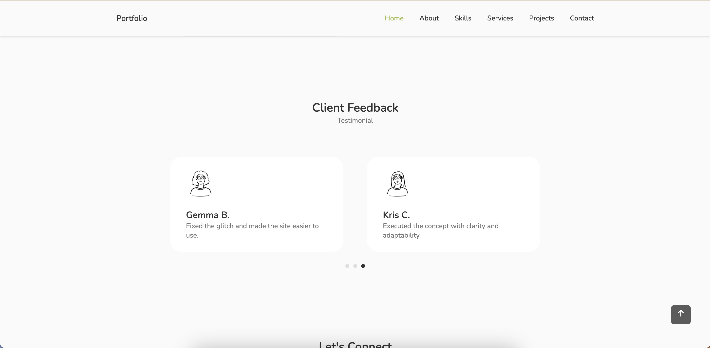
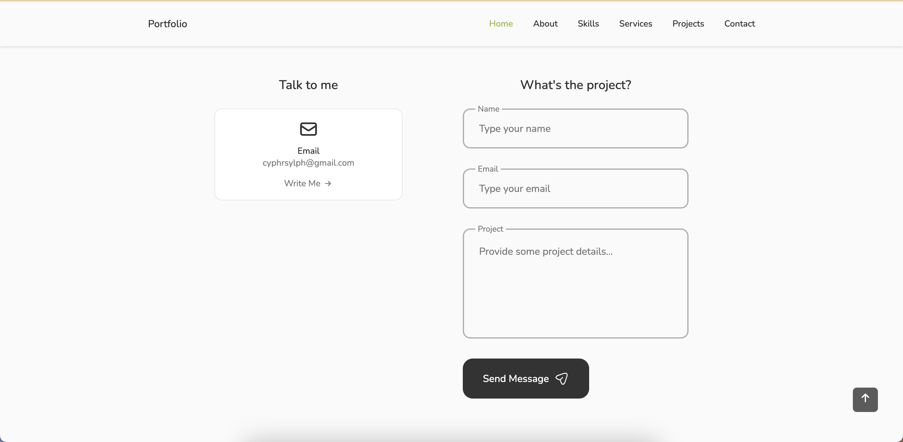

# Portfolio Project

This dynamic portfolio website showcases your work and skills using ReactJS, a popular JavaScript framework. It adapts to different screen sizes (responsive design) and utilizes plain CSS for styling. Additionally, it incorporates Swiper for smooth transitions and animations, and EmailJS for handling contact form submissions.

### Project Features:
- Responsive Layout
- Fixed Navigation
- Pop-up Modals
- Tab Panels
- Slider + Pagination
- Contact Form
- Scroll to Top

## React-Icons
`npm install react-icons --save`

The icons from this project can be found in the *Feather* or *Heroicon* sections of the [React-Icons](https://react-icons.github.io/react-icons/) library. 

## Slider Component
`npm i swiper`

The slider component of the testimonial section is imported from [SwiperJS](https://swiperjs.com/react) and also utlizes their pagination module.

## Email Component
`npm install @emailjs/browser --save`

The form modal of the contact section is setup using SDK and an email template from [EmailJS](https://www.emailjs.com/docs/examples/reactjs/).

## Credit
This project was built following a tutorial by Cryptical Coder. It can be found [here](https://www.youtube.com/watch?v=3aCoZudPEKE&t=143s&ab_channel=CrypticalCoder) if you'd like to give it a try.
