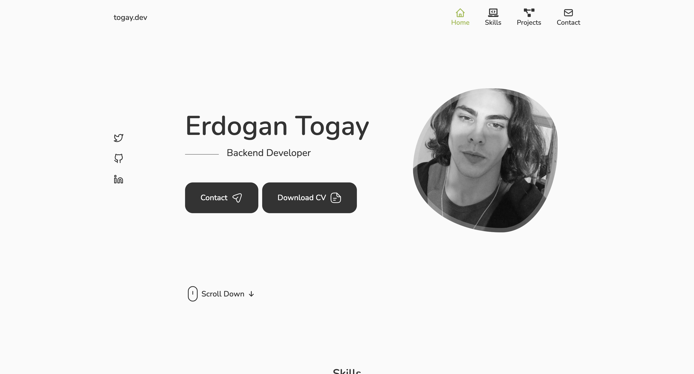

# Portfolio Project

This dynamic portfolio website showcases your work and skills using ReactJS, a popular JavaScript framework. It adapts to different screen sizes (responsive design) and utilizes plain CSS for styling. Additionally, it incorporates Swiper for smooth transitions and animations, and EmailJS for handling contact form submissions.

## Credit
This project was inspired by [Cryptical Coder]((https://www.youtube.com/watch?v=3aCoZudPEKE)https://www.youtube.com
